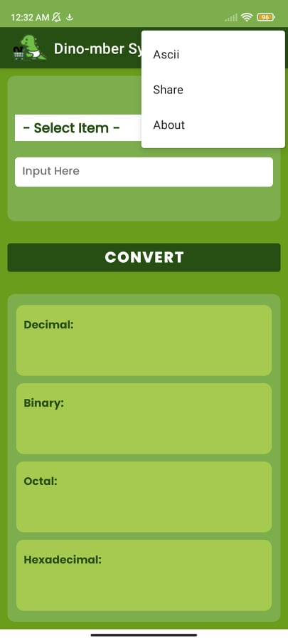
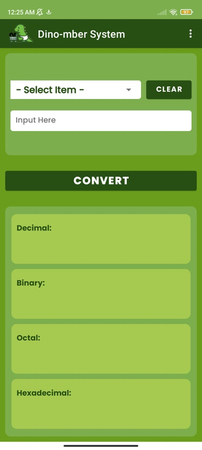
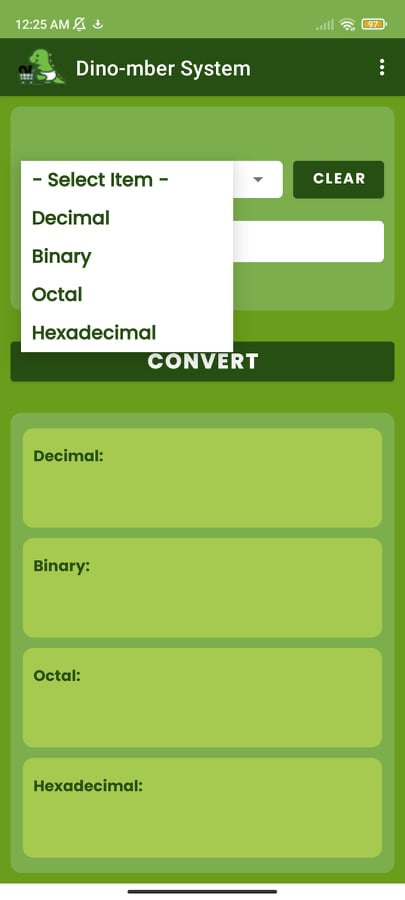
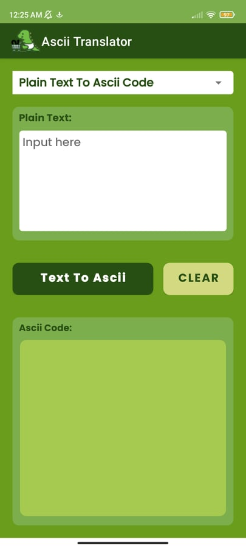
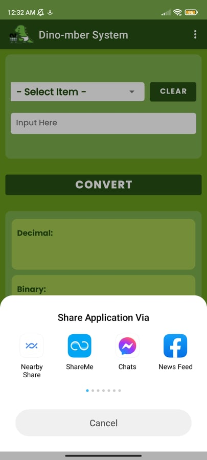

  <h1>🔢 DINOMBER: A NUMBER SYSTEM CONVERTER</h1>

## Introduction 

The **Dinomber-System Application** is a user-friendly tool designed to simplify number system conversions. With an intuitive interface, users can convert numbers between various formats (binary, decimal, octal, and hexadecimal) by just entering the desired numeral. The application offers automatic conversion and ensures accurate results with minimal input.

This tool is developed in Java and is available for Android, making it accessible and practical for users on both desktop and mobile platforms. Whether you are a student, developer, or hobbyist, this application provides a quick and reliable solution for number system conversions.

## Objectives 
- **Seamless Conversion:** Allow users to input a number and convert it between binary, decimal, octal, and hexadecimal formats with a single click of the "Convert" button.
- **Automatic Calculation:** The conversion is triggered by the user's action to click the "Convert" button, providing instant results for the selected number system.
- **User-Friendly Interface:** Clean, simple, and easy-to-use interface for all users, making the conversion process straightforward.
- **Mobile Compatibility:** Designed specifically as a mobile APK, ensuring a smooth and responsive experience for Android users.

## Significance of the Project 
The **Dinomber-System** application significantly enhances the understanding of number system conversions. It can serve as a valuable educational tool for students learning about computer science and mathematics. Additionally, it helps professionals and developers with quick conversions in day-to-day work, reducing the need for manual calculations.

The app also has the potential to contribute to the growth of technology accessibility, providing simple yet powerful functionality to users worldwide.

## Scope and Limitation 
The application focuses on converting numbers across four primary systems: binary, decimal, octal, and hexadecimal. It is a Java-based tool that currently supports Android devices and desktop systems. While the app offers great ease of use, it may not support complex or non-standard number systems at this time. Furthermore, advanced features such as multi-step conversions are not yet implemented.

## GUI Preview 

  
  
  

  
  
  

## Conclusion and Recommendation 

### Conclusion

The **Dinomber-System** application provides an essential tool for anyone needing fast, reliable, and efficient number system conversions. It simplifies the process with a clean interface and accurate results. This app is especially useful in educational and professional contexts where conversions are frequent.

### Recommendation
- **Expand System Support:** Consider adding support for additional number systems or more complex conversions.
- **User Customization:** Implement customization features like themes and units to enhance user experience.
- **Globalization:** Expand language support to cater to a broader user base, reflecting the application's commitment to global accessibility.
- **Enhance Offline Mode:** Although the app works offline, consider adding features that could further improve its offline usability, such as saving conversion history or providing more customization options offline.

